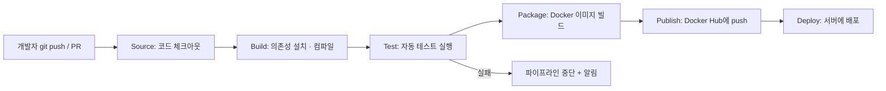

# 1회차 · CI/CD란 무엇인가 (개념 이해)

> 목표: "CI/CD"라는 단어를 들었을 때 **무엇을, 왜, 어떤 흐름으로** 자동화하는지 말로 설명할 수 있다.

---

## 1. 한 줄 정의

- **CI (Continuous Integration, 지속적 통합)**
  개발자들이 작성한 코드를 **자주(하루에도 여러 번) 공용 브랜치에 합치고**,
  합칠 때마다 **자동으로 빌드 + 테스트**해서 문제를 빨리 잡는 것.

- **CD (Continuous Delivery / Deployment, 지속적 전달 / 배포)**
  CI를 통과한 코드를 **자동으로 릴리스 가능한 상태로 만들고(Delivery)**,
  더 나아가 **실제 서버까지 자동으로 배포(Deployment)** 하는 것.

정리하면 **"코드를 합치고 → 검증하고 → 내보내는" 과정을 사람 손 대신 파이프라인이 대신 하는 것**이 CI/CD다.

---

## 2. 왜 필요한가 (없을 때 생기는 문제)

### 문제 1. 통합 지옥 (Integration Hell)
- 각자 2주씩 따로 개발하다가 마지막에 한 번에 머지 → 충돌 폭발, "내 PC에선 됐는데" 발생.
- CI는 **작은 단위로 자주 합쳐서** 충돌과 버그를 매번 조금씩만 처리하게 만든다.

### 문제 2. 수동 테스트의 한계
- 사람이 매번 전체 기능을 손으로 확인 → 느리고, 빠뜨리고, 지침.
- CI는 **커밋마다 테스트를 기계가 반복** → 회귀 버그(예전에 되던 게 깨짐)를 즉시 발견.

### 문제 3. 수동 배포의 위험
- 서버에 SSH 접속 → 명령어 여러 개 순서대로 입력 → 하나 틀리면 장애.
- 배포하는 사람만 방법을 알고, 그 사람이 휴가 가면 배포 불가.
- CD는 **배포 절차를 코드로 고정** → 누가 눌러도 똑같이, 실패하면 자동 중단/롤백.

### 결과적으로 얻는 것
- 피드백이 빨라짐 (버그를 몇 주 뒤가 아니라 몇 분 뒤에 앎)
- 릴리스가 작고 잦아짐 → 한 번 배포의 리스크 감소
- 사람은 반복 작업 대신 기능 개발에 집중

---

## 3. CI의 구성 요소

| 요소 | 의미 |
|---|---|
| 버전 관리 | 모든 코드는 Git 저장소 하나에 모임 (single source of truth) |
| 자주 통합 | 기능 브랜치를 작게 만들고 자주 main에 머지 (PR 기반) |
| 자동 빌드 | 푸시/PR마다 소스가 실제로 빌드되는지 확인 |
| 자동 테스트 | 유닛 테스트 등으로 동작 검증, 실패 시 머지 차단 |
| 빠른 피드백 | 결과를 PR 화면 / 알림으로 즉시 보여줌 |

핵심 규칙: **"main은 항상 배포 가능한 상태를 유지한다."**

---

## 4. CD: Delivery와 Deployment의 차이

```
CI 통과 → 아티팩트 생성 → 스테이징 배포 → (승인) → 프로덕션 배포
                                      └── 여기서 갈림 ──┘
```

| 구분 | Continuous Delivery (지속적 전달) | Continuous Deployment (지속적 배포) |
|---|---|---|
| 프로덕션 배포 | **사람이 버튼 클릭(승인)** 후 배포 | 승인 없이 **자동 배포** |
| 언제 쓰나 | 배포 타이밍을 통제하고 싶을 때 | 테스트 신뢰도가 높고 빠른 출시가 중요할 때 |
| 공통점 | 프로덕션 직전까지는 **완전 자동** |

> 약자 CD는 둘 다를 가리킨다. 문맥상 "자동 배포까지 하느냐"로 구분하면 된다.

---

## 5. 파이프라인 흐름 (이 로드맵에서 만들 최종 그림)



- **왼쪽(Source~Test)** = CI 영역 → 3회차에서 집중
- **가운데(Package~Publish)** = 4·5회차
- **오른쪽(Deploy)** = 6·7회차
- **캐싱·매트릭스·알림** 같은 최적화 = 8회차

---

## 6. GitHub Actions 용어 맛보기 (2회차 예고)

| 용어 | 뜻 | 비유 |
|---|---|---|
| **Workflow** | 자동화 전체 정의 (`.github/workflows/*.yml`) | 요리 레시피 전체 |
| **Event / Trigger** | 워크플로우를 실행시키는 사건 (`push`, `pull_request`, `schedule` 등) | "손님이 주문함" |
| **Job** | 하나의 실행 단위, 기본적으로 병렬 | 요리 코스 (전채/메인) |
| **Step** | Job 안의 개별 명령 | 레시피의 각 단계 |
| **Action** | 재사용 가능한 Step 묶음 (`actions/checkout` 등) | 반제품 소스 |
| **Runner** | Job이 실제로 돌아가는 가상 머신 (`ubuntu-latest` 등) | 주방 |

가장 작은 예시 (2회차에서 직접 작성):

```yaml
name: CI
on: push                    # 트리거: push 될 때마다
jobs:
  build:
    runs-on: ubuntu-latest  # 러너
    steps:
      - uses: actions/checkout@v4   # 코드 가져오기
      - run: echo "Hello CI/CD"     # 명령 실행
```

---

## 7. 자주 나오는 오해 정리

| 오해 | 실제 |
|---|---|
| "CI/CD는 대규모 팀만 필요하다" | 1인 프로젝트도 배포 실수 방지·회귀 버그 감지에 유용 |
| "CI/CD = Jenkins/GitHub Actions 같은 도구" | 도구는 수단일 뿐, 본질은 **자주 통합하고 자동 검증하는 습관** |
| "테스트 없이도 CI 가능" | 자동 테스트가 없으면 CI의 효과 대부분이 사라짐 |
| "CD를 켜면 항상 프로덕션에 자동 배포된다" | Continuous Delivery는 승인 단계를 둘 수 있음 |

---

## 8. 이번 회차 배운 점 (요약)

- CI = **자주 합치고 + 합칠 때마다 자동 빌드/테스트**, 목표는 "main을 항상 배포 가능하게".
- CD = CI 통과분을 **자동으로 릴리스/배포**, Delivery(승인 후) vs Deployment(완전 자동).
- CI/CD의 가치는 자동화 도구 자체가 아니라 **피드백을 빠르게, 배포를 작고 안전하게** 만드는 것.
- 파이프라인은 `Source → Build → Test → Package → Publish → Deploy` 흐름이고,
  이 로드맵에서 회차별로 이 단계를 하나씩 GitHub Actions로 구현한다.
- 다음 회차(2회차)에서는 `.github/workflows/`에 첫 워크플로우 YAML을 직접 작성한다.

---

## 참고 링크

- GitHub Actions 공식 문서: https://docs.github.com/actions
- "Continuous Integration" — Martin Fowler: https://martinfowler.com/articles/continuousIntegration.html
- CI vs Delivery vs Deployment 그림: https://www.atlassian.com/continuous-delivery/principles/continuous-integration-vs-delivery-vs-deployment
