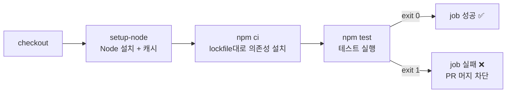

# 3회차 · 코드 자동 테스트하기 (CI의 핵심)


> 목표: push/PR마다 자동으로 테스트가 돌고, **테스트가 깨지면 CI가 빨개져서 머지를 막는** 흐름을 직접 만든다.
>
> 📌 **직접 해보기: [`실습.md`](./실습.md) 의 미션을 순서대로 진행하세요.**
> 정답 워크플로우는 [`solution.yml`](./solution.yml).

---

## 1. 왜 "자동 테스트"가 CI의 핵심인가

2회차에서 만든 건 "실행되는 워크플로우"였지, 아직 **검증**은 없었다.
CI(지속적 통합)의 본질은 *"코드를 합칠 때마다 기계가 검증한다"* 인데, 그 검증의 핵심이 **자동 테스트**다.

| 없을 때 | 있을 때 |
|---|---|
| 내가 고친 코드가 남의 기능을 깼는지 모른 채 머지 | push하는 순간 전체 테스트가 돌아 회귀(regression) 즉시 발견 |
| "리뷰어가 알아서 확인하겠지" | 리뷰 전에 기계가 1차 필터링 |
| 버그가 배포까지 흘러감 | 테스트 실패 = 파이프라인 중단 → 배포 안 됨 |

핵심 규칙(2회차에서 이어짐): **"테스트가 통과하지 않은 코드는 main에 들어갈 수 없다."**

---

## 2. 테스트 자동화가 성립하는 3가지 조건

1. **명령 하나로 전체 테스트 실행** — `npm test`, `pytest`, `go test ./...` 등
2. **성공/실패를 종료 코드(exit code)로 알린다** — 통과 `0`, 실패 `0이 아님`
   - GitHub Actions는 step의 종료 코드가 0이 아니면 그 step을 실패로 처리 (2회차 미션4에서 본 것과 동일)
3. **테스트가 환경에 의존하지 않는다** — 내 PC에서만 되는 테스트는 CI에서 깨진다

이번 실습의 샘플 앱은 `03-auto-test/app/` 에 있고, `npm test`(내부적으로 Jest) 한 줄로 돈다.

---

## 3. CI에서 테스트를 돌리는 표준 순서



| step | 하는 일 | 왜 이 액션/명령인가 |
|---|---|---|
| `actions/checkout@v4` | 저장소 코드를 러너로 가져옴 | 코드가 있어야 테스트함 (2회차 미션3) |
| `actions/setup-node@v4` | 지정한 Node 버전 설치 + npm 캐시 | 러너 기본 Node에 의존하지 않도록 버전 고정 |
| `npm ci` | `package-lock.json` **그대로** 설치 | `npm install`과 달리 lockfile을 안 바꿈 → 재현성 보장, CI에 적합 |
| `npm test` | `package.json` 의 `scripts.test` 실행 | 프로젝트가 정의한 테스트 명령 |

### `npm install` vs `npm ci`
| | `npm install` | `npm ci` |
|---|---|---|
| lockfile | 없으면 만들고, 다르면 갱신 | 반드시 있어야 함. 안 맞으면 **에러** |
| 속도 | 상대적으로 느림 | `node_modules` 지우고 새로 → 깨끗하고 빠름 |
| 용도 | 로컬 개발 | **CI** |

---

## 4. 캐시 (`cache: npm`)

`setup-node` 의 `cache: npm` 옵션은 `~/.npm`(다운로드된 패키지)을 저장해뒀다가
다음 실행에서 `package-lock.json` 이 그대로면 재사용한다 → `npm ci` 가 훨씬 빨라진다.

- 첫 실행: 캐시 없음 → 전부 다운로드 후 저장 ("Cache saved")
- 다음 실행: lockfile 해시 일치 → 캐시 복원 ("Cache restored")
- lockfile이 바뀌면 캐시 키가 달라져 새로 받음

> 캐시 세부 제어(키 직접 지정 등)는 8회차에서 다룬다. 여기선 옵션 한 줄로 켠다.

---

## 5. PR과 상태 체크 (Status Check)

`on: pull_request` 를 넣으면 PR을 열/갱신할 때도 워크플로우가 돈다.
그 결과가 PR 화면에 **체크 표시**로 붙는다.

- ✅ 초록 체크 → 이 브랜치는 테스트 통과
- ❌ 빨간 X → 통과 못 함. (설정에 따라) **Merge 버튼 비활성화**

저장소 Settings → Branches → **Branch protection rule** 에서
"Require status checks to pass before merging" 를 켜면 물리적으로 머지가 막힌다.
(개인 저장소라 이번 실습에선 규칙 없이 "체크가 빨개지는 것"까지만 확인한다.)

---

## 6. 상태 배지 (Badge)

README에 현재 CI 상태를 보여주는 이미지:

```markdown

```

- `03-test.yml` 워크플로우의 최신 main 실행 결과를 실시간 반영
- passing이면 초록, failing이면 빨강

---

## 7. 자주 하는 실수

| 증상 | 원인 |
|---|---|
| `npm ci` 가 `npm ci can only install with an existing package-lock.json` | lockfile을 커밋 안 함 |
| CI에선 테스트 실패, 로컬은 통과 | Node 버전 차이 / 로컬 `node_modules` 에만 있는 패키지 / 타임존·로케일 의존 |
| 워크플로우가 앱 폴더를 못 찾음 | `defaults.run.working-directory` 또는 step별 `working-directory` 누락 |
| 캐시가 매번 미스 | `cache-dependency-path` 가 실제 lockfile 위치와 다름 |
| 테스트가 깨졌는데 job은 성공 | `npm test` 가 실패해도 exit 0을 냄 (테스트 러너 설정 문제) |

---

## 8. 이번 회차 배운 점

- CI의 핵심은 "합칠 때마다 자동 테스트" → 테스트 실패 = 파이프라인 중단.
- 표준 순서: `checkout → setup-node(+cache) → npm ci → npm test`.
- `npm ci` 는 lockfile 그대로 설치 → CI용. `npm install` 은 로컬 개발용.
- `on: pull_request` + 상태 체크로 "깨진 코드는 머지 못 하게" 만든다.
- 다음 회차(4회차)에서는 테스트를 통과한 코드로 **Docker 이미지를 자동 빌드**한다.

### 실습하며 관찰한 것
- (미션1) `npm test` 통과 시 `echo $?` = `0`. 이 종료 코드가 CI 성공/실패 판정의 전부.
  로컬은 `node_modules` 가 남아 있어 `npm install` 이 `added 1`, CI 러너는 깨끗해서 `npm ci` 가 `added 267`.
- (미션2) 첫 실행은 `Cache not found` → 끝에 `Cache saved (key: ...lockfile해시...)`.
  다시 돌리면 `Cache restored` 로 바뀌고 `npm ci` 가 빨라짐.
- (미션3) 소스 한 줄(`Math.ceil`→`Math.floor`) 바꾸니 로컬에서 통과하던 테스트가 CI에서 즉시 실패.
  로그에 `Expected: 3334 / Received: 3333` + 실패한 소스 줄 표시 → 버그 위치가 바로 특정됨.
  `##[error]Process completed with exit code 1` → step 실패 → job 실패. `git revert` 로 초록 복귀.
- (미션4) `on:` 에 `push` + `pull_request` 를 둘 다 넣어서 PR에 체크가 2개(`test (push)`, `test (pull_request)`).
  브랜치에 수정 커밋을 push 하면 PR 체크가 **자동으로 다시 실행**됨. PR은 브랜치 최신 상태를 계속 검증.
- (미션5) 배지 URL 은 `.../workflows/03-test.yml/badge.svg`, main 최신 실행 결과를 SVG로 반환(5분 캐시).
- (도전) `strategy.matrix.node: [18,20,22]` → `test (18/20/22)` 3개 병렬. `${{ matrix.node }}` 로 step 이름과
  `node-version` 을 동시에 치환. 총 소요 시간은 가장 느린 복제본 기준.

---

## 참고 링크

- `actions/setup-node` (캐시 포함): https://github.com/actions/setup-node
- `npm ci` 문서: https://docs.npmjs.com/cli/v10/commands/npm-ci
- 워크플로우 상태 배지: https://docs.github.com/actions/monitoring-and-troubleshooting-workflows/adding-a-workflow-status-badge
- 브랜치 보호 규칙: https://docs.github.com/repositories/configuring-branches-and-merges-in-your-repository/managing-protected-branches/about-protected-branches
